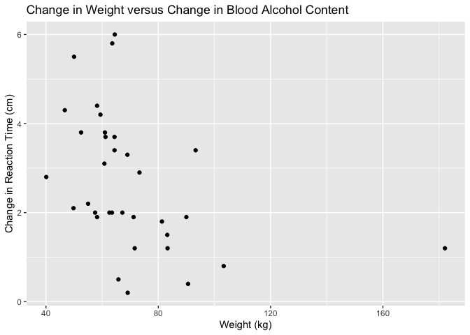

The Islands, Part 2: Study
================
Aidan Schneider, Danny Kennen, Bhargavi Deshpande, Esther Aduamah, Elisa
Camacho, Amir Osorio
2025-4-13

- [Grading Rubric](#grading-rubric)
  - [Individual](#individual)
  - [Submission](#submission)
- [Setup](#setup)
  - [**q1** Planning a study (TEAMWORK)](#q1-planning-a-study-teamwork)
  - [**q2** EDA](#q2-eda)
  - [**q3** Key Analyses](#q3-key-analyses)
  - [**q4** Answers](#q4-answers)

*Purpose*: This is part 2 of 2. In part 1 you *planed* your statistical
project, particularly your data collection. In this part you will give
updates on your plan, and report your findings.

This challenge is deliberately shorter so you have time to collect and
analyze your data.

*Important note*: While we expect that you did your data collection with
your team, you need to complete your own individual report for c10.

<!-- include-rubric -->

# Grading Rubric

<!-- -------------------------------------------------- -->

Unlike exercises, **challenges will be graded**. The following rubrics
define how you will be graded, both on an individual and team basis.

## Individual

<!-- ------------------------- -->

| Category | Needs Improvement | Satisfactory |
|----|----|----|
| Effort | Some task **q**’s left unattempted | All task **q**’s attempted |
| Observed | Did not document observations, or observations incorrect | Documented correct observations based on analysis |
| Supported | Some observations not clearly supported by analysis | All observations clearly supported by analysis (table, graph, etc.) |
| Assessed | Observations include claims not supported by the data, or reflect a level of certainty not warranted by the data | Observations are appropriately qualified by the quality & relevance of the data and (in)conclusiveness of the support |
| Specified | Uses the phrase “more data are necessary” without clarification | Any statement that “more data are necessary” specifies which *specific* data are needed to answer what *specific* question |
| Code Styled | Violations of the [style guide](https://style.tidyverse.org/) hinder readability | Code sufficiently close to the [style guide](https://style.tidyverse.org/) |

## Submission

<!-- ------------------------- -->

Make sure to commit both the challenge report (`report.md` file) and
supporting files (`report_files/` folder) when you are done! Then submit
a link to Canvas. **Your Challenge submission is not complete without
all files uploaded to GitHub.**

# Setup

<!-- ----------------------------------------------------------------------- -->

``` r
library(tidyverse)
```

    ## ── Attaching core tidyverse packages ──────────────────────── tidyverse 2.0.0 ──
    ## ✔ dplyr     1.1.4     ✔ readr     2.1.5
    ## ✔ forcats   1.0.0     ✔ stringr   1.5.1
    ## ✔ ggplot2   3.5.1     ✔ tibble    3.2.1
    ## ✔ lubridate 1.9.4     ✔ tidyr     1.3.1
    ## ✔ purrr     1.0.2     
    ## ── Conflicts ────────────────────────────────────────── tidyverse_conflicts() ──
    ## ✖ dplyr::filter() masks stats::filter()
    ## ✖ dplyr::lag()    masks stats::lag()
    ## ℹ Use the conflicted package (<http://conflicted.r-lib.org/>) to force all conflicts to become errors

``` r
library(rsample)

# TODO: Include any other packages you need
```

### **q1** Planning a study (TEAMWORK)

While you provided this plan in c08 (Part 1), please include your plan
here. In particular, describe how you updated your plan in response to
feedback.

#### Population

- (What population are you going to study?)
  - We will be studying the Akkeshi Population in The Islands. We used
    random sampling to get a random sampling of 30 houses, with the
    participants being over 18 years old.

#### Quantity of interest

- Our quantity of interest is the change reaction time measured by the
  length in centimeters caught after the ruler is dropped

#### Covariates

- Weight, height, age, amount of alcohol consumed, reaction time before
  consumption, reaction time after consumption

#### Observation or experiment?

The Islands allows you to ask islanders to complete tasks. If you just
take measurements on your participants, then it’s an *observational
study*. But if you also introduce something that’s meant to change the
outcome of a measurement (e.g., drinking coffee before taking a test),
that’s called an *experimental study*. You need to decide whether your
study is observational or experimental.

- Experiment because we are introducing alcohol to the residents of
  Akkeshi and recording the changes in reaction times.

#### Question / Hypothesis

- (Write your question / hypothesis here)
  - How do the height and weight of an individual affect their reaction
    time when drinking 4 shots of alcohol? We changed it from our
    original question to include height and weight.

#### Sampling plan

- (What steps will you take to collect the data?)
  - Be specific. For instance, if you’re going to collect a random
    sample, how will you enumerate all of the things to be sampled?
  - Write a protocol. Document step-by-step instructions that your team
    will follow. That way, you can feasibly split up data collection
    among the whole team, while making sure each team member doesn’t
    make ad hoc decisions that introduce bias into your results.

First, we all met together at the same time to create/open our The
Islands logins together. As a team, we decided to focus on Akkeshi. We
did a random sampling with set.seed to figure out which houses we were
going to be checking. We put all of these numbers in a spreadsheet. We
split up the households so every member of the team would have five
houses to cover; this was so we did our test relative in the same time
period in Akkeshi. We recorded every member of the household’s height,
weight, and name as long as they were 18 and consented. If they did not
consent we entered them as “NA” on our data sheet. We all recorded the
Blood Alcohol Content (B.A.C.) and reaction time (by doing the Ruler
Test) before and after alcohol consumption for every single person. We
gave everyone four tequila shots back to back and waited five real-world
minutes before checking their blood alcohol content. This is so the
alcohol could sit for a bit and get into their systems. We then
re-recorded their reaction time and went on to the next person in the
household, or new house if no one else fit the requirements for our
study.

- (How will you ensure the data is representative of your chosen
  population?)

As we did a random sampling, the data is representative as we have
thirty houses from nine to 447 all on Akkeshi Island.

- (For experiments only: How will you ensure any effects you observe are
  due to the treatment, and not due to other factors?)

30 houses because it was manageable for us to collect the data and we
considered that in some houses there is more than one person and not
every person will give us their consent to participate in our
experiment.

- (How will you choose your sample size?)
- This should be a mix of how confident you want to be in your results,
  and what is actually *feasible* for your research team.

30 houses because it was manageable for us to collect the data and we
considered that in some houses there is more than one person and not
every person will give us their consent to participate in our
experiment.

``` r
## Select a random sample of houses
n_houses <- 450
n_sample <- 30

set.seed(101)   # Set a seed for reproducibility

df_numbers_random <- 
  tibble(
    house = sample(
        1:n_houses,     # All integers from 1 to n_houses
        n_sample,       # Size of our sample
        replace = FALSE # Sample *WITHOUT* replacement
      )
  ) %>% 
  # Arrange for our data collection convenience
  arrange(house)

# Pull the column so we can list just the house numbers
df_numbers_random %>% 
  pull(house)
```

    ##  [1]   9  14  45  59  95  97 117 128 131 159 204 209 240 244 246 288 313 315 316
    ## [20] 317 329 351 352 354 355 430 431 440 442 447

### **q2** EDA

Conduct an EDA on your data. Add as many code chunks as you need. Ensure
your EDA gives enough context of the data for us to understand what
comes next in this report.

``` r
# Load the data CSV

filename <- "./c10-islands-pt2-data.csv"
df_reaction <- read_csv(filename)
```

    ## Rows: 49 Columns: 9
    ## ── Column specification ────────────────────────────────────────────────────────
    ## Delimiter: ","
    ## chr (1): Person Name
    ## dbl (8): House Number, B.A.C Before (g/dL), Reaction Time Before (cm), B.A.C...
    ## 
    ## ℹ Use `spec()` to retrieve the full column specification for this data.
    ## ℹ Specify the column types or set `show_col_types = FALSE` to quiet this message.

``` r
# EDA

df_eda <- df_reaction %>% 
  na.omit %>% 
  mutate(
    delta_bac = `B.A.C. After 5 mins (g/dL)` - `B.A.C Before (g/dL)`,
    delta_react = `Reaction Time After 5 mins` - `Reaction Time Before (cm)`
    ) 

df_eda %>% 
  ggplot(aes(x = delta_bac, y = delta_react)) +
  geom_point() +
  geom_smooth(method = lm, se = FALSE) +
  labs(
  title = "Change in Blood Alcohol Content (BAC) Versus Reaction Time",
  x = "Change in Blood Alcohol Content (BAC) (g/dL)",
  y = "Change in Reaction Time (cm)"
  ) +
  scale_colour_gradientn(colours = terrain.colors(10))
```

    ## `geom_smooth()` using formula = 'y ~ x'

<!-- -->

Fig. 1: The figure here demonstrates the relationship between the change
in reaction time versus the change in BAC. This data was gathered by
finding the difference in the islanders initial reaction times to their
reaction times after they consumed alcohol, and finding the difference
in their BAC before alcohol consumption and after. There is a decent
correlation between Blood Alcohol Content being higher and reaction
times changing more and vice versa.

``` r
df_eda %>% 
  # coloring points 
  ggplot(aes(x = delta_bac, y = delta_react, color = `Weight (kg)`)) +
  geom_point() +
  geom_smooth(method = lm, se = FALSE) +
  labs(
  title = "Change in Blood Alcohol Content (BAC) Versus Reaction Time",
  x = "Change in Blood Alcohol Content (BAC) (g/dL)",
  y = "Change in Reaction Time (cm)"
  ) +
  scale_colour_gradientn(colours = terrain.colors(10))
```

    ## `geom_smooth()` using formula = 'y ~ x'

    ## Warning: The following aesthetics were dropped during statistical transformation:
    ## colour.
    ## ℹ This can happen when ggplot fails to infer the correct grouping structure in
    ##   the data.
    ## ℹ Did you forget to specify a `group` aesthetic or to convert a numerical
    ##   variable into a factor?

<!-- -->

Fig. 2: In this figure we colored each of the points on a gradient
according to each individual’s weight. This graph seems to suggest that
lower individual weights correspond to greater change in BAC and
Reaction Time, but this is a difficult conclusion to make definitively.
We use the following graph to show a clearer correlation.

``` r
df_eda %>% 
  # coloring points 
  ggplot(aes(x = `Weight (kg)`, y = delta_bac)) +
  geom_point() +
  labs(
  title = "Relationship Between Weight and Change in Blood Alcohol Content (BAC)",
  x = "Weight (kg)",
  y = "Change in Blood Alcohol Content (BAC) (g/dL)"
  ) +
  scale_colour_gradientn(colours = terrain.colors(10))
```

<!-- -->

Fig 3: The above graph compares individuals’ weight versus the change in
their BAC. As we can see there is a clear inverse correlation between
the change in weight and the change in blood alcohol content. Since this
graph sufficiently demonstrates that weight may be an indicator of the
severity of an individual’s response to alcohol, we then wanted to
investigate whether there was a relationship between Weight and Change
in Reaction Time.

``` r
df_eda %>% 
  # coloring points 
  ggplot(aes(x = `Weight (kg)`, y = delta_react)) +
  geom_point() +
  labs(
  title = "Change in Weight versus Change in Blood Alcohol Content",
  x = "Weight (kg)",
  y = "Change in Reaction Time (cm)"
  ) +
  scale_colour_gradientn(colours = terrain.colors(10))
```

<!-- -->

Fig. 4: The above graph shows a clear inverse relationship between an
individuals’ weight and change in their reaction time. The higher the
weight of the individual, the changes in reaction times tend to be
lower. We saw from the first graph that reaction times are correlated to
BAC, so it is reasonable to state that oftentimes individuals with
higher weight will have a lower BAC and will have a faster reaction time
after alcohol consumption.

``` r
df_eda %>% 
  # coloring points 
  ggplot(aes(x = Age, y = delta_react)) +
  geom_point() +
  labs(
  title = "Relationship Between Age and Change in Reaction Time",
  x = "Age",
  y = "Change in Reaction Time (cm)"
  ) +
  scale_colour_gradientn(colours = terrain.colors(10))
```

<!-- -->

Fig. 5: Another factor we thought could affect blood alcohol level, and
thus the individual’s reaction time, was the age of the person. However,
from plotting Age versus Change in Reaction Time (cm) we saw that there
was no distinct correlation. Within the age range of 20 to 40 year olds
we saw a large spread in the change in reaction time, thus, we
determined that age may not be a factor in this scenario.

### **q3** Key Analyses

Present the key analyses that support your questions / hypotheses. This
could include summary statistics (e.g., a proportion of Islanders),
grouped summary statistics (e.g., a proportion for group A, and for
group B), or visualizations (e.g., a histogram). This section should be
short, and every analysis should directly relate to q4.

In Figure 1 we see that there is a clear correlation between change in
blood alcohol (BAC) content and change in reaction time. In Figure 2 and
3 we find that one of the greatest indicators of how an individual’s
reaction time will change in response to the alcohol dose is greatly
influenced by their weight. In Figure 5 we wanted to see if there was a
similar correlation between Age and Reaction time, for which we found no
such correlation.

### **q4** Answers

Connect your Key Analyses to your questions / hypotheses. What did you
conclude from your study?

We concluded that weight is more of a determining factor than age for a
change in reaction time when individuals are given the same quantity of
alcohol. We also saw that a higher blood alcohol concentration resulted
in more of a change in reaction time.
